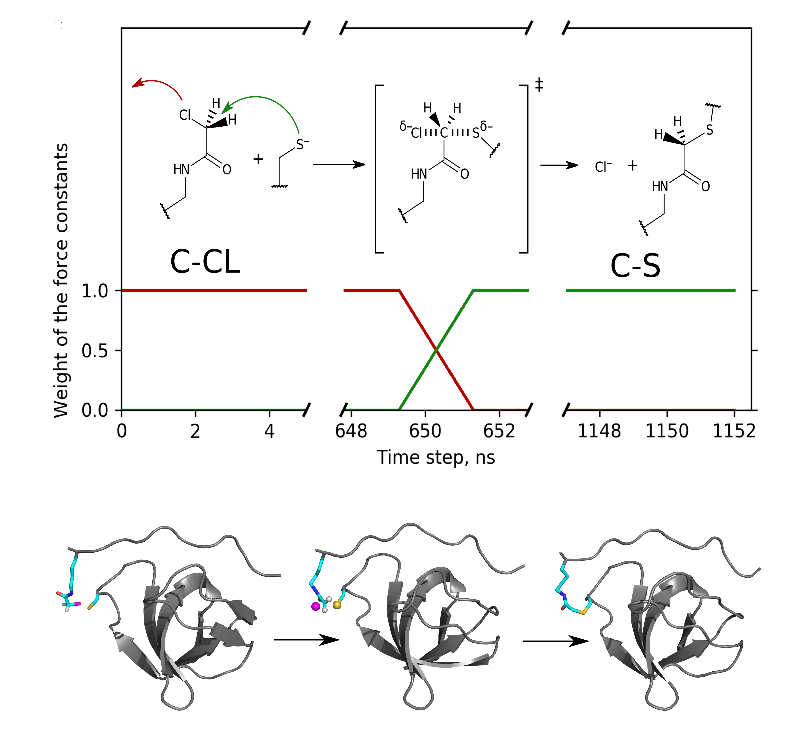

Molecular Dynamics model of peptide-protein conjugation: case study of covalent complex between Sos1 peptide and N-terminal SH3 domain from Grb2
######################################################################################################################################################

This repo contains additional materials for the `paper <https://doi.org/10.1038/s41598-019-56078-7>`_ including:

- leap library files for all modified residues described in this paper (C-terminal deprotonated lysine, non-terminal Nε-chloroacetyl lysine, C-terminal Nε-chloroacetyl lysine, non-terminal cysteine residue modified by conjugation with Nε-chloroacetyl lysine, non-terminal Nε-chloroacetyl lysine residue modified by conjugation with cysteine, C-terminal Nε-chloroacetyl lysine residue modified by conjugation with cysteine)
- force-field parameter modification file
- python script to run reactive MD simulations

